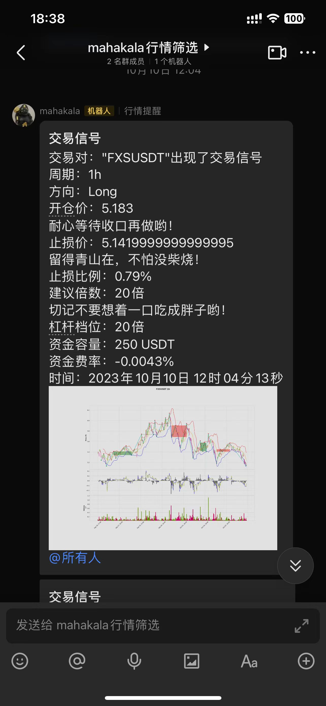

# mahakala

这是对量化交易的一次研究和探索

***项目起源的idea：*** 7月份因为在外旅游，错过行情的节奏，萌生了一个想法，能不能将自己交易的理论模型化和指标化，来达到自动化提醒的目的，这样就不用每天盯着电脑看盘了，也不用担心错过行情的节奏了。

因为交易中的许多理论和概念都是多维度参考的，所以想通过程序来将各种指标和理论实现并通过自己的逻辑整合，这样就可以通过程序来自动化的提醒了。

## 为什么直接从mahakala-python转为本项目
本项目最初是[mahakala-python](https://github.com/A1anSong/mahakala-python)，python在数据分析上的确有很大的优势，但是对于数据获取来说，python的效率并不是很高，所以在花了一两周将mahakala-python稍微完善后，为了提高效率，开启了本项目，为的是将数据获取和数据分析分开，数据获取使用golang，数据分析使用python，这样可以充分发挥各自的优势。

在并发获取币安永续合约交易对的数据时，由于python语言的设计原因，无法充分发挥多核的优势，所以在获取数据时，使用golang来获取数据，然后将数据存储到数据库中，然后使用python来进行数据分析和绘图。

后续关于项目效率优化的一些想法：analyze基于CUDA来提高分析的效率，同时也可以使用GPU来进行绘图，这样可以充分发挥GPU的优势，提高效率。

## 了解本项目可能需要的准备
数据库选型：基于PostgreSQL的TimescaleDB扩展用于存储数据，因为数据量比较大，所以选用了时序数据库，TimescaleDB是基于PostgreSQL的，所以可以使用PostgreSQL的所有功能，同时还有时序数据库的优势。可以参考[Timescale文档](https://docs.timescale.com/)自行部署

分析绘图：使用的是[mplfinance](https://github.com/matplotlib/mplfinance)，基于[matplotlib](https://matplotlib.org)和[pandas](https://pandas.pydata.org)的绘图库，可以视作是matplotlib的一个拓展，可以绘制各种K线图，同时还可以绘制各种指标，比如均线、MACD、KDJ等等

## 项目结构

项目主要分为两个部分，一个是数据获取（server），一个是数据分析（analyze）。

## 展示部分截图

